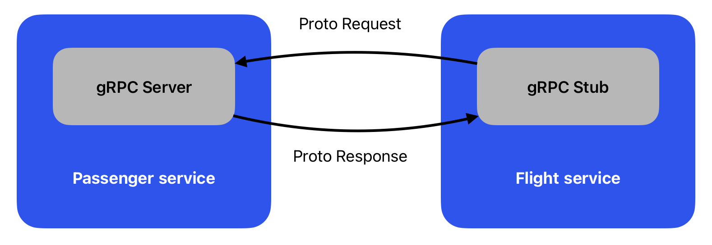
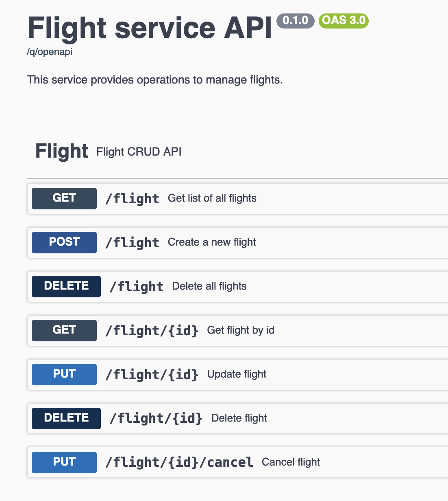

# 03 - OpenAPI specification and gRPC

## What is the role of API?

The main role of Application programming interface (API) is to allow easy communication between different software
components. It should describe the functionality of the component and the way it can be used. The API should be easy to
use and understand.

### Contract first approach

API is a first-class citizen meaning that it should be designed before the implementation. This approach is called
contract first. The contract is a document that describes the API. The most popular format to define API documentation
is OpenAPI.

It's a good approach to spend more time on designing the API so other services (and teams) could rely on it when
implementing their own services. It shouldn't be changed. If it's necessary to change the API, it should be done in a
backward compatible way. Eg. versioning the api like `/api/v1/...` and `/api/v2/...`.

#### Benefits of contract first approach

- Teams can work in parallel on business logic since the API is already defined
- The API is designed with the client in mind
- No unused endpoints

#### Drawbacks of contract first approach

- Limited flexibility for changes in the API
- Upfront time and effort to design the API

### Code first approach

The code first approach is the opposite of the contract first approach. First the code is written and then the API is
generated from the code.

#### Benefits of code first approach

- Easy to start
- Flexible with change the API
- The API is always up to date

#### Drawbacks of code first approach

- The API is not designed with the client in mind
- May result in unused endpoints that are just "hanging around"

## OpenAPI specification

OpenAPI is a specification standard for describing REST APIs. It's a language-agnostic format that can be used to
describe APIs for different programming languages.

It is an open standard for describing your APIs, allowing you to provide an API specification encoded in a JSON or YAML
document embedding the fundamentals of HTTP and JSON.

### OpenAPI in Quarkus

Quarkus supports OpenAPI specification generation from the code via `quarkus-smallrye-openapi` extension that we
installed in the first lecture.

We can extend OpenAPI specification with additional information using `@OpenAPIDefinition` annotation for the whole
application.

```java

@OpenAPIDefinition(
        tags = {
                @Tag(name = "widget", description = "Widget operations."),
                @Tag(name = "gasket", description = "Operations related to gaskets")
        },
        info = @Info(
                title = "Example API",
                version = "1.0.1",
                contact = @Contact(
                        name = "Example API Support",
                        url = "http://exampleurl.com/contact",
                        email = "techsupport@example.com"),
                license = @License(
                        name = "Apache 2.0",
                        url = "https://www.apache.org/licenses/LICENSE-2.0.html"))
)
public class FlightServiceApplication extends Application {
    //...
}
```

Note that `FlightServiceApplication` extends `Application` class from `jakarta.ws.rs.core.Application`. It's kinda "
entry point" for application. It's not necessary to extend this class, but it's required for the use
of `@OpenAPIDefinition`.

We can also provide additional information for resources using `@Tag` annotation.

```java

@Tag(name = "Flight resource", description = "Provides Flight CRUD operations")
public class FlightResource {
    //...
}
```

When you will run `quarkus dev` in flight-service, you can see the OpenAPI specification in the browser
at http://localhost:8079/q/openapi.

## What is gRPC?

gRPC is a high performance, open-source universal Remote Procedure Call (RPC) framework. It's based on HTTP/2 and
Protocol Buffers. You can imagine it as a middleware between your service and outside world. 


*image from https://grpc.io/docs/what-is-grpc/introduction/*

### Main features:

- HTTP/2 based - low latency, multiplexing, header compression, stream prioritization
- High performance - binary protocol, efficient serialization, asynchronous by default
- Bidirectional streaming - client and server can send messages at the same time

### Differences between REST and gRPC

| REST          | gRPC                         |
|---------------|------------------------------|
| HTTP/1.1      | HTTP/2                       |
| Text based    | Binary                       |
| JSON, XML     | Protocol Buffers             |
| Stateless     | Bidirectional streaming      |
| Client-server | Client-server, server-server |
| HTTP verbs    | RPC methods                  |

### Protocol Buffers

Protocol Buffers are Interface Definition Language (IDL) for describing both the service interface and the structure of the payload messages. It's a binary format that is smaller and faster than JSON. It's defined in `.proto` files.

Sample `src/main/proto/helloworld.proto` file:

```proto
syntax = "proto3";

option java_multiple_files = true;
option java_package = "io.quarkus.example";
option java_outer_classname = "HelloWorldProto";

package helloworld;

// The greeting service definition.
service Greeter {
    // Sends a greeting
    rpc SayHello (HelloRequest) returns (HelloReply) {}
}

// The request message containing the user's name.
message HelloRequest {
    string name = 1;
    string surname = 2;
}

// The response message containing the greetings
message HelloReply {
    string message = 1;
}
```

From this file, Quarkus can generate Java classes that can be used in your application. To generate the classes use `mvn compile`.

## State of the project

We have two services - `passenger-service` and `flight-service`. 

- `flight-service` is a REST service that provides CRUD operations for flights. You already know this service from the previous lectures. Runs on port `8079`.
- `passenger-service` is a REST service that provides CRUD operations for passengers and get new notifications. Also, it provides a gRPC interface to notify passenger about flight cancellation. Runs on port `8078`.

## Tasks

### 1. Add OpenAPI specification

#### 1.1 Create information about the application

Create `FlightServiceApplication` class in `cz.muni.fi` that extends `Application` class from `jakarta.ws.rs.core.Application`. Add
`@OpenAPIDefinition` annotation with `info` field. Add title, version and description as shown in the screenshot bellow.


#### 1.2 Create information about the resource
Add `@Tag` annotation for `FlightResource` class. Provide name and description as shown in the screenshot bellow.




### 2. Generate Grpc classes

#### 2.1. Add `quarkus-grpc` extension

Add `quarkus-grpc` extension.

```bash
quarkus extension add quarkus-grpc
```

#### 2.2. Modify `flight-service.proto` file

In `flightcancelation.proto` file add under the configuration `FlightCancellation` service with `CancelFlight` rpc that will take `CancelFlightRequest` with `id` and `reason` fields. It will return `CancelFlightResponse` with `status` field.

#### 2.3. Generate classes

Run `mvn compile` to generate classes from `.proto` files.

When you run this command, you should be able to generated classes in `target/generated-sources/grpc/cz/muni/fi/proto` directory. Check if they are there.

If you are using IntelliJ, run `mvn compile` from IDE Maven plugin under lifecycle. Idea has problem of recognizing generated classes. Or reload all maven projects.

### 3. Implement `FlightCancellationService`

#### 3.1. Create `FlightCancellationService` class in `cz.muni.fi.grpc` package. That base file should look like this: 

```java
package cz.muni.fi.grpc;
import cz.muni.fi.proto.FlightCancellation;
import cz.muni.fi.proto.FlightCancellationRequest;
import cz.muni.fi.proto.FlightCancellationResponse;
import io.quarkus.grpc.GrpcService;
import io.smallrye.mutiny.Uni;

@GrpcService
public class FlightCancellationService implements FlightCancellation {
   // TODO implement methods
}
```

Check if idea see the `FlightCancellation` class. If not, run Maven compile from IDE Maven plugin under lifecycle.

#### 3.2. Implement `cancelFlight` method


### X. Submit the solution

[//]: # (TODO after setting up github classroom)

## Hints

- Type of id should be `int32` in `.proto` file.

## Troubleshooting

- If the `flight-service` cannot find dependency `passenger-service` run `mvn clean install` in `passenger-service` directory.

## Further reading

- https://quarkus.io
- https://www.openapis.org/
- https://swagger.io/resources/articles/adopting-an-api-first-approach/
- https://www.visual-paradigm.com/guide/development/code-first-vs-design-first/ 
- https://grpc.io/docs/what-is-grpc/introduction/
- https://quarkus.io/guides/grpc-getting-started