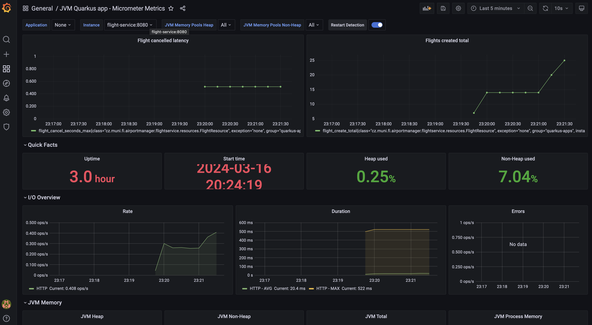
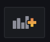
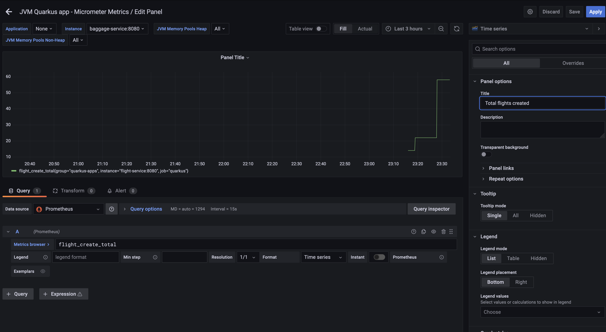

# 08 - Health, metrics, and monitoring

## Health checks

Health checks are critical for cloud applications to monitor the state of the application. They are used to verify the application's state. This usually means if the application is running, if it is ready to serve requests, or if it is connected to the database, kafka, or other dependent services.

For example, Kubernetes uses health checks to determine if a container is running and if it is ready to serve requests or if it should be restarted.

It's also useful for monitoring tools to check the state of the application and send alerts if something is wrong and you need to take action.

### What should be checked?

- If the service is running.
- If the database is connected.
- If other dependencies are connected.
- Check if external services are available.
- Resource usage (CPU, memory, network,...).

#### Types

1. Liveness -- The liveness probe checks if the service is healthy. If the probe fails, the service is not running, cannot be recovered, and should be restarted.
2. Readiness -- The readiness probe checks if the application is ready to serve traffic; requests are not prohibited. Dependencies, databases, and external services are connected. If the readiness probe fails, the service is not yet ready to serve traffic, but it's not considered a failure, and the service is not restarted. This probe prevents routing to the instance which is warming up or loading data.
3. Startup -- The startup probe determines if the application considers itself successfully initialized. That doesn't necessarily mean it's ready to serve traffic, but rather that all core components and configurations are loaded and initialized.

### SmallRye Health

SmallRye Health is an implementation of MicroProfile Health. It simplifies the process of creating health checks and provides a way to check the state of the application. Due to the built-in health checks it also exposes some of this information out-of-the-box.

1. `HealthCheck` interface -- Health checks are implemented as classes that implement the `HealthCheck` interface.
2. `@Liveness` annotations -- Checks if the service is running.
3. `@Readiness` annotations -- Checks if the service is connected to the database/kafka,... without any additional code and is ready to serve requests.
4. `@Startup` annotations -- Option for slow starting containers to delay an invocation of the liveness check.

## Monitoring and Metrics

Observability is a key feature of the service. It's important to monitor what is happening inside the application, to be able to react to the problems, and to improve the performance.

### What do we want to measure?

- **Uptime** -- How long the service is running.
- **Rate of requests** -- How many requests are coming to the service.
- **Latency** -- How long it takes to process the request.
- **Error rate** -- How many requests are failing.
- **Memory usage** -- How much memory is used.
- **CPU usage** -- How much CPU is used.
- **Network usage** -- How much data is sent and received.
- **Custom metrics** -- Business-specific metrics.

### Custom metrics

Business specific metrics are important to understand the state of the application. For example, how many passengers are being onboarded, how much baggage are lost, etc.

## Tools for metrics and monitoring


### Micrometer metrics

Micrometer metrics provides a way to collect metrics and send them to the monitoring system. With `micrometer-registry-prometheus` extension, we can send metrics to the Prometheus like memory usage, CPU usage, latency, custom metrics, etc.

Micrometer monitors the state of the application and expose those metrics on the `/q/metrics` endpoint for Prometheus to scrape.

### Prometheus

Prometheus is a monitoring system that collects metrics from the services and stores them in a database. It provides a way to query and visualize the metrics.

It pulls the metrics data form the `/q/metrics` endpoint of the services every few seconds and stores them in the database for further analysis. We can then write a query in PromQL that can be visualized in visualization solution like Grafana.

Prometheus can also send alerts if the metrics are not in the expected range.

#### Custom metrics

- **Gauge** -- A metric that represents a single numerical value that can arbitrarily go up and down.
- **Counter** -- A metric that represents a single numerical value that only ever goes up. Cumulative in nature.
- **Summary** -- A metric to represent the distribution of a set of values.
- **Timer** -- A metric to measure the duration of a particular event.

#### Example custom metrics

```java
public class PassengerResource {
    
    @Counted(value = "passenger_onboard", description = "How many passengers are onboarded")
    public void onboardPassenger() {
        // ... 
    }
    
    // or
   
    @Timed(value = "passenger_onboard_duration", description = "How long it takes to onboard a passenger")
    public void onboardPassenger() {
        // ... 
    }
}
```

### Grafana

Grafana is a visualization tool that provides a way to visualize the metrics collected by data providers (in our case Prometheus). Through dashboards, we can monitor the state of services.

Capabilities:

- **Dashboards** -- Create dashboards to visualize the metrics.
- **Alerting** -- Set up alerts to notify if the metrics are not in the expected range.
- **Data sources** -- Connect to different data sources like Prometheus.
- **Plugins** -- Extend the functionality with plugins.
- **Explore** -- Write queries to explore the data.




## State of the project

- Added new service Prometheus to docker compose which is running on http://localhost:9090 to collect the metrics.
  - `prometheus.yml` is configured to scrape the metrics from the services. 
- Added new service Grafana to docker compose which is running on http://localhost:3000 to visualize the metrics.
  - `./grafana` folder is configured to connect to Prometheus as a data source with default JVM dashboard to monitor the application.

## Tasks

### 0. Running docker

Install [Docker desktop](https://docs.docker.com/desktop/) or other docker client.

### 1. Add health check to `passenger-service`

In `passenger-service` you will implement custom readiness health check to check if the baggage service is ready.

#### 1.1. Add `smallrye-health` extension to `passenger-service`

Add `smallrye-health` extension to `passenger-service` by running add extension command.

#### 1.2. Implement `Readiness` check

Go to health package in `passenger-service` and implement `BaggageServiceHealthCheck` class. This class should implement `AsyncHealthCheck` interface and check readiness of the baggage service. 

In `BaggageClientResource` you can find new method `readinessCheck` which should be used to check if the baggage service is ready.

Check if the response `.getStatus()` from `readinessCheck` is `HealthCheckResponse.Status.UP` then return `HealthCheckResponse.up`. Otherwise, return `HealthCheckResponse.down`. 

#### 1.3. Test it

Run the service and go to http://localhost:8078/q/health/ready. You should see the status of the health checks including status of the baggage service.

### 2. Add custom metrics to `flight-service`

#### 2.1. Add custom counter metric to `FlightResource`

In `FlightResource` class, add a counter metric to count the number of flights created.

#### 2.2. Add custom timer metric to `FlightResource`

In `FlightResource` class, inject `MeterRegistry` and add a timer metric to measure the duration of the `cancel` method.

#### 2.3. Check the metrics in Prometheus

1. Run the services using docker compose. (See hints for the helper command)
2. Create some flights
3. Cancel some flights
4. Go to http://localhost:9090/graph. 
   - Write a query to check the number of flights created. Should be named `flight_created_total` that indicates the number of flights created.
   - Write a query to check the duration of the cancel method. Should be named `flight_cancel_seconds_max` that indicates the maximum duration of the cancel method.
5. Switch tab to `Graph` and select the time range to see the graph for better visualization.

### 3. Add panel to Grafana

Now, there is already a dashboard in Grafana prepared that is collection the metrics from Prometheus. 

#### 3.1. Open Grafana

Go to http://localhost:3000 and login with `username=admin` and `password=secret`.

#### 3.2. Do some stuff in the application

Create some flights, passengers and baggage so we can see some data in the dashboard.

#### 3.3. Go to dashboard 

Navigate to `Dashboards`-->`Home` and select `JVM Quarkus app - Micrometer Metrics` dashboard.

You should be able to see statistics about the service that you can change using instances selector. 

Change the time range to see the data for the last 5 minutes.

#### 3.4. Add new panel

1. Now, add a new panel to the dashboard to show the number of flights created.

    

2. Select *Add an empty panel*.
3. Fill out the query to `flight_create_total` to show the number of flights created and change the title of the panel to `Flights created`.

    
4. Add another panel to show the duration of the cancel method.
5. Save the dashboard. Final result should look like this:

    

Now you should be able to see the number of flights created in the dashboard as one of our custom metrics.

### X. Submit the solution

[//]: # (TODO after setting up github classroom)

## Hints

- Build and run docker 
  ```bash
  cd passenger-service && mvn clean install && cd ../baggage-service && mvn clean install && cd ../flight-service && mvn clean install && cd .. && docker compose up --build
  ```

## Troubleshooting

- Check if your docker engine is running.

## Further reading

- https://quarkus.io/guides/smallrye-health
- https://quarkus.io/blog/micrometer-prometheus-openshift/
- https://quarkus.io/guides/smallrye-metrics
- https://quarkus.io/guides/telemetry-micrometer
- https://www.tigera.io/learn/guides/prometheus-monitoring/
